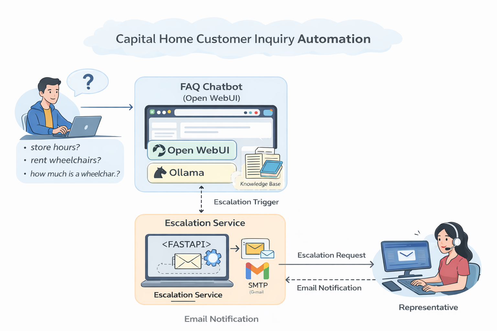

# Capital Home Customer Inquiry Automation

## Overview

This project is a proof-of-concept customer inquiry assistant for Capital Home Medical Equipment.

It was designed to help handle common customer questions in a structured way, while escalating questions that cannot be answered automatically.

The solution focuses on questions such as:
- store hours
- store locations
- rentals
- product categories
- delivery at a general level
- repairs and installation
- sleep and respiratory services
- pricing and availability escalation

## Solution Summary

The project uses two main parts:

1. **FAQ Chatbot**
   - Built with Open WebUI
   - Uses a curated knowledge base based on approved business information
   - Answers common questions in a clear and professional way

2. **Escalation Service**
   - Built with FastAPI
   - Classifies questions that require human follow-up
   - Sends an escalation email for unsupported or sensitive inquiries such as exact pricing or live stock checks

## Architecture



The solution uses a chatbot interface, a local language model, a curated FAQ knowledge base, and a separate escalation service.

- **Open WebUI** provides the chatbot interface
- **Ollama** runs the local model (`llama3.2:3b`)
- **Knowledge Base** stores approved FAQ content
- **FastAPI Escalation Service** handles questions that need human follow-up
- **Email Notification** sends escalation requests to a representative


## Technologies Used

- Open WebUI
- Ollama
- Llama 3.2 3B
- FastAPI
- Python
- Docker
- Gmail SMTP

## Representative Questions

### Supported Questions

- Do you have a location in Kanata?
- What time do you open in Kanata?
- Do you rent wheelchairs?
- Do you offer oxygen therapy equipment?
- Can I get help with CPAP or sleep apnea equipment?

### Escalation-Only Questions

- How much is a wheelchair?
- Is this item in stock right now?
- Can you deliver this to my address tomorrow?

## Setup

### 1. Run Open WebUI

```bash
docker volume create open-webui

docker run -d \
  -p 3000:8080 \
  -v open-webui:/app/backend/data \
  --name open-webui \
  ghcr.io/open-webui/open-webui:main
```
Open:
```bash
http://localhost:3000
```

### 2. Run Ollama

Make sure Ollama is installed, then start it:

```bash
ollama serve
```

Pull the model if needed:
```bash
ollama pull llama3.2:3b
```

### 3. Connect Open WebUI to Ollama

In Open WebUI, connect the local Ollama model and select `llama3.2:3b`

### 4. Upload the Knowledge Base

Create a knowledge base in Open WebUI and upload the FAQ markdown file.

Suggested name:

Pull the model if needed:
```bash
Capital Home FAQ
```

### 5. Run the Escalation Service

From the `escalation-service` folder:

```bash
python3 -m venv .venv
source .venv/bin/activate
pip install -r requirements.txt
uvicorn app.main:app --reload
```

The service runs at:

```bash
http://127.0.0.1:8000
```

### Email Configuration

Create a `.env` file in `escalation-service`:

```bash
SMTP_HOST=smtp.gmail.com
SMTP_PORT=587
SMTP_USERNAME=your-email@gmail.com
SMTP_PASSWORD=your-app-password
SMTP_FROM=your-email@gmail.com
```

### Escalation Workflow

When a question cannot be answered automatically:

1. the question is classified by the FastAPI service
2. if escalation is required, an email is sent to a human representative
3. the customer receives this response:

I’m sorry, but I can’t confirm that automatically. I will escalate your inquiry to a team member for follow-up.

### Demo Flow
1. Ask a supported FAQ question in Open WebUI
2. Show the chatbot response
3. Test an escalation question using the escalation API
4. Show the escalation email received in Gmail

### Assumptions

- The prototype uses publicly available business information and a curated FAQ knowledge base, not live internal systems.
- Exact inventory, pricing, delivery timing, and order-specific details are not available automatically and require staff follow-up.
- The chatbot is intended to act as a first-line support assistant for common questions, not a replacement for staff.

### Limitations

- The system is not connected to live inventory, pricing, order management, or insurance systems.
- Responses depend on the quality and completeness of the uploaded FAQ content.
- Escalation is handled by email, so follow-up still depends on a human representative responding.

### Future Improvements
- Connect the assistant to live business systems for real-time pricing, availability, and order status.
- Add a more seamless escalation workflow inside the chat interface instead of a separate API/demo step.
- Extend the solution for voice use, such as speech-to-text for incoming calls and text-to-speech for responses.
- Add an admin workflow to update FAQ content more easily as business information changes.
